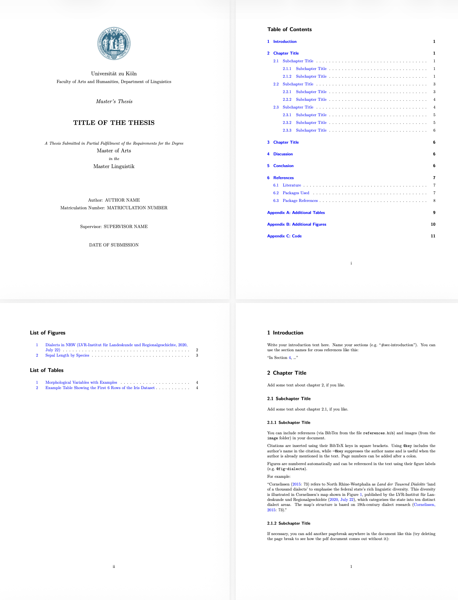

# Quarto Thesis Template (Linguistics)

This repository provides a Quarto template for a term paper, BA thesis, or MA thesis in linguistics with:

-   PDF output
-   figures, tables, and linguistic examples
-   cross-references (sections, figures, tables)
-   APA-style citations
-   IPA symbols

## Preview

## Requirements

-   R (≥ 4.1)

-   RStudio

-   Quarto

-   LaTeX distribution (TinyTeX); install TinyTeX in R: `tinytex::install_tinytex()`

-   Charis font (version 7.000); download it from: <https://software.sil.org/charis/download/>

## **Installing Charis:**

The template uses the Charis font family to render IPA symbols. For TinyTeX/XeLaTeX to recognize it, Charis must be installed system-wide (for all users).

**macOS:**

1.  Open the application "Font Book" and click on "My Fonts".
2.  Drag the downloaded "Charis-7.000" folder into "My Fonts".

**Windows:**

1.  Unzip the downloaded "Charis-7.000" folder and open it.
2.  Mark all .ttf files, right-click, choose "Show more options", and "Install for all users".
3.  Restart RStudio after installation.

**Ubuntu:**

1.  Unzip the downloaded "Charis-7.000" folder.
2.  Copy the font files to the system directory: `sudo cp Charis-7.000/*.ttf /usr/share/fonts/`.
3.  Update the font cache: `sudo fc-cache -f`.

## How to use

1.  Click "Code" and "Download ZIP"
2.  Unzip and open the folder
3.  Open `thesis.Rproj` in RStudio
4.  Open `thesis.qmd` and start writing

## Citations

-   Add your references in BibTeX format to the bibliography file: `references.bib`

-   Citation style: APA 7 (`apa_7th.csl`)

## Rendering the thesis

To render the thesis as a PDF click "Render" in RStudio or: `quarto::quarto_render("thesis.qmd")`

## License

This template is released under the CC0-1.0 license. You are free to modify and redistribute it.

## How to cite

DOI to be added.
